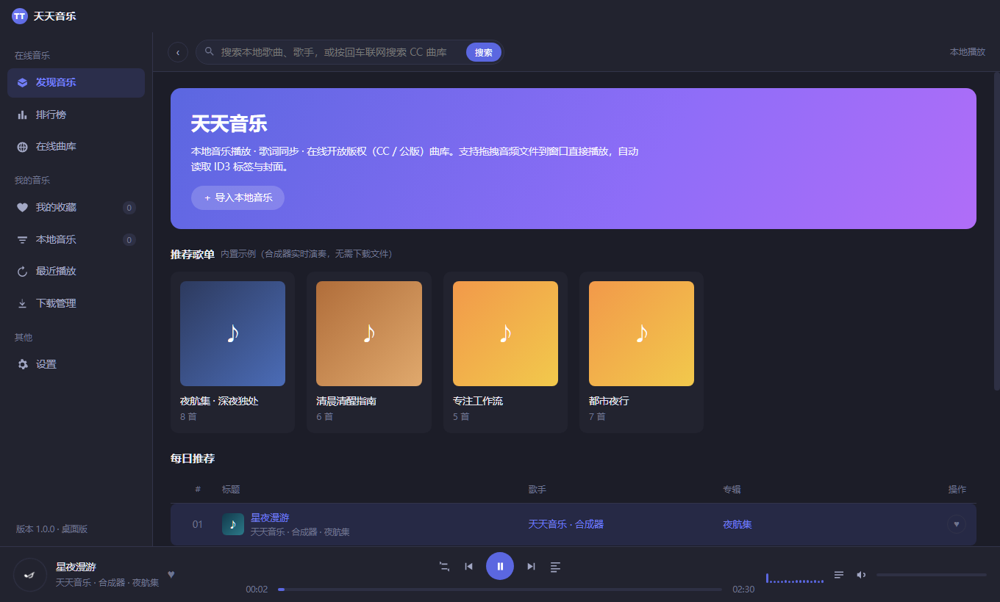
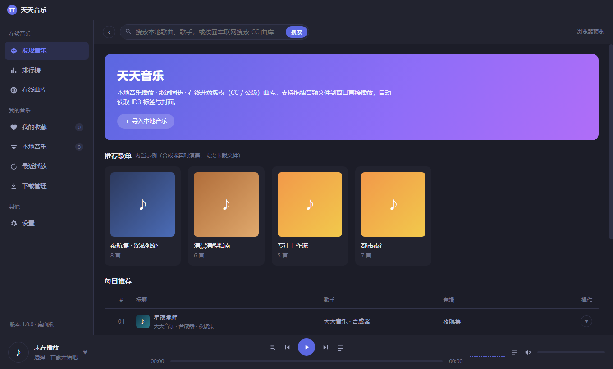
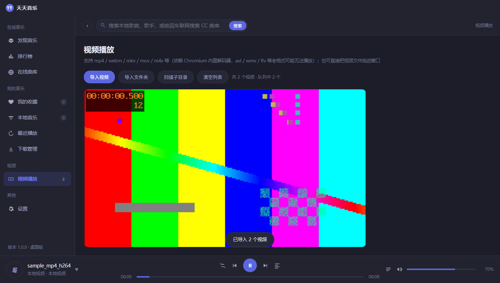

# 天天音乐 (TianTian Music)

一款开源的桌面音乐播放器：本地音乐 + 开放版权在线曲库 + 歌词，开箱即用。视觉上采用深色无边框窗口、左侧导航、底部播放条与紫蓝强调色。



## 下载（Windows）

| 版本 | 文件 | 说明 |
|---|---|---|
| v1.0.0 | [TianTianMusic-v1.0.0-win64.zip](https://github.com/wenwen-1982/tiantian-music/releases/download/v1.0.0/TianTianMusic-v1.0.0-win64.zip) | Windows 10/11 64 位绿色版，105.6 MB，解压后双击 `天天音乐.exe` 即可运行，无需安装 |

全部版本见 [Releases](https://github.com/wenwen-1982/tiantian-music/releases)。

### 安装到本机（双击文件直接播放）

解压后先双击 `天天音乐.exe` 运行一次，然后：

1. 左侧「设置」→ 点 **安装到本机**（或关闭程序后用命令行 `天天音乐.exe --install` 打开安装器）
2. 选择安装位置（默认 `%LOCALAPPDATA%\Programs\天天音乐`）、勾选要关联的格式，点 **立即安装**
3. 安装完成后点 **在系统设置中设为默认** → 在系统弹出的页面里选择「天天音乐」

安装后会在开始菜单创建「天天音乐」文件夹（含卸载入口）与可选的桌面快捷方式，
并写入当前用户的卸载信息（控制面板 / 设置 → 已安装应用里可卸载）。全程不需要管理员权限。

> Windows 10 1903+ 不允许程序静默夺取某个扩展名的默认归属：安装会把天天音乐登记进
> 「打开方式」和系统「默认应用」列表；尚未指定默认程序的格式（如 flac、mkv、flv 等）
> 安装后即可直接双击打开，已被其它程序占用的格式需要在系统设置里切换一次。

## 功能

| 模块 | 说明 |
|---|---|
| 内置示例曲库 | 8 首合成器曲目由 WebAudio 实时生成（无需任何音频文件即可试听），含推荐歌单、排行榜 |
| 本地音乐 | 导入文件 / 文件夹 / 拖拽入窗口；自动解析 MP3 ID3v2 标签与内嵌封面 |
| 视频播放 | mp4 / webm / mkv / mov / m4v 直接播；avi / wmv / flv / rmvb / mpg / vob 等老格式首次播放时自动转 MP4（优先 `-c copy` 换容器，秒级无损；老编码才转 H.264 + AAC），结果按文件指纹缓存，下次直接播放 |
| 老格式支持 | 依赖内置 ffmpeg.exe（61.5 MB，GPL 精简构建）。安装目录 `resources\ffmpeg.exe`；缺失时老格式会提示转换失败，其余功能不受影响 |
| 进度条 | 播放条、视频画面（含全屏）、画中画悬浮条三处均带可拖动进度条与时间显示；画中画窗口内无法注入界面，故悬浮条常驻应用底部 |
| 歌词 | LRC 解析 + 逐行高亮卡拉OK式滚动；LRCLIB 联网匹配；支持手动导入 .lrc |
| 在线曲库 | ccMixter（CC 授权）搜索、在线播放、下载到本地；桌面版带进度显示 |
| 播放控制 | 顺序 / 单曲循环 / 随机、播放队列、收藏、最近播放、频谱可视化 |
| 音量 | 底部播放条与设置页实时显示百分比，支持拖动 / 滚轮 / ↑↓ 调节、点击图标静音记忆 |
| 主题 | 6 种主题色、深色 / 浅色模式，全部设置本地持久化 |
| 安装与文件关联 | 内置安装器（`--install`）：复制到 `%LOCALAPPDATA%\Programs\天天音乐`、写文件关联 / 卸载项 / 快捷方式；单实例，双击关联文件直接播放，第二次双击复用已有窗口 |
| 快捷键 | 空格播放暂停 · ←/→ 快退快进 5s · Ctrl+←/→ 切歌 · ↑/↓ 音量 · F 视频全屏 · Esc 关闭歌词页 |

| 发现页 | 歌词页 | 视频播放 |
|---|---|---|
|  |  |  |

## 运行

### 浏览器预览（零依赖）

直接双击打开 `index.html`，或在项目目录执行：

```bash
npx serve .
```

> 浏览器模式下「在线曲库」可能受跨域策略限制，本地播放 / 歌词 / 合成器曲目均正常。

### 桌面版（推荐，功能完整）

```bash
npm install        # 安装 electron
npm start          # 启动桌面版
```

桌面版特性：无边框自绘标题栏、本地文件/文件夹选择对话框、递归扫描目录、下载到指定目录（默认 `音乐\天天音乐下载`）。

## 打包 Windows 免安装版

```bash
npm run fetch-ffmpeg     # 下载精简 ffmpeg.exe（61.5 MB）到 build/（仓库不含该二进制）
npm run dist             # electron-builder → 便携版 exe
```

产物为绿色免安装目录 / 单文件 exe，双击 `天天音乐.exe` 即可运行。已发布的成品见上方 [下载](#下载windows-免安装版)。

> 若网络无法直连 npm 的 Electron 二进制源，可先手动下载 `electron-v31.7.7-win32-x64.zip`（如 npmmirror 镜像），解压后：
>
> ```bash
> npm run pack                       # 用 @electron/asar 打出 app.asar（自动剥离 BOM）
> node build/deploy.js "D:\天天音乐"  # 同步 app.asar + ffmpeg.exe 到安装目录
> ```
>
> 再把 `electron.exe` 重命名为 `天天音乐.exe` 即可得到便携版。
>
> **ffmpeg.exe 必须放在 `resources\` 目录（与 `app.asar` 同级），不能打进 asar** —— asar 内的二进制无法被 `child_process` 直接执行。查找顺序为：`resources\ffmpeg.exe` → 应用根目录 → `build\ffmpeg.exe` → 系统 PATH。

## 目录结构

```
tiantian-music/
├── index.html            # 应用外壳
├── assets/
│   ├── css/style.css     # 主题样式
│   ├── icon.png          # 应用图标（512×512）
│   └── js/
│       ├── engine.js     # 音频引擎（文件播放 + WebAudio 合成器 + 频谱）
│       ├── video.js      # 视频引擎（<video> 封装：倍速 / 全屏 / 画中画）
│       ├── library.js    # 曲库数据 / ID3 解析 / LRC 解析 / 存储
│       ├── api.js        # ccMixter / LRCLIB / 下载接口
│       └── app.js        # 界面状态与交互
├── installer.html        # 安装 / 卸载界面
├── electron/
│   ├── main.js           # 主进程（窗口 / 下载 / 文件扫描 / 命令行打开文件）
│   ├── transcode.js      # ffmpeg 转码（老格式 → MP4，带缓存与进度）
│   ├── assoc.js          # 文件关联注册表（HKCU，含 PowerShell 与 .reg 双通道）
│   ├── installer.js      # 安装 / 卸载：复制、快捷方式、卸载项、清理
│   └── preload.js        # contextBridge 桥接
├── build/
│   ├── icon.ico          # Windows 打包图标（多尺寸）
│   ├── pack-asar.js      # 打 app.asar（剥 BOM 并校验 package.json）
│   ├── fetch-ffmpeg.js   # 下载精简 ffmpeg.exe
│   └── deploy.js         # 同步 app.asar + ffmpeg.exe 到安装目录
└── preview/              # 运行截图
```

## 技术要点

- **零音频素材**：内置曲目由 `OscillatorNode` / `BiquadFilter` / 噪声鼓组合成，纯代码生成。
- **ID3v2 解析**：手写 MP3 标签解析器，读取标题/歌手/专辑/APIC 内嵌封面，不依赖三方库。
- **LRC 解析**：支持多时间戳行、逐行二分查找定位当前句。
- **可视化**：`AnalyserNode` 实时频谱绘制到 Canvas。
- **持久化**：收藏、历史、主题、音量等状态存于 `localStorage`。

## 版权说明

在线曲库仅接入 **ccMixter（CC 授权）** 与歌词库 **LRCLIB** 等开放版权内容源；本地文件播放不涉及任何在线音源。请遵守各曲目标注的授权条款。本项目仅用于学习与技术交流。

## License

[MIT](LICENSE)
